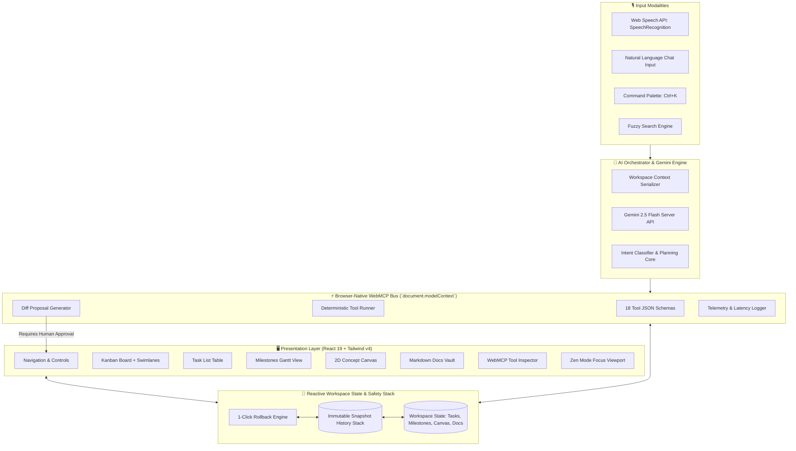
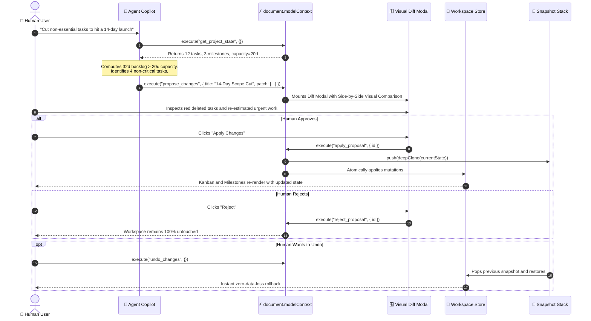
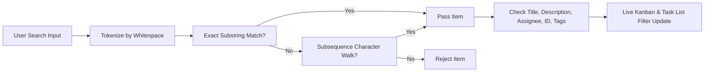
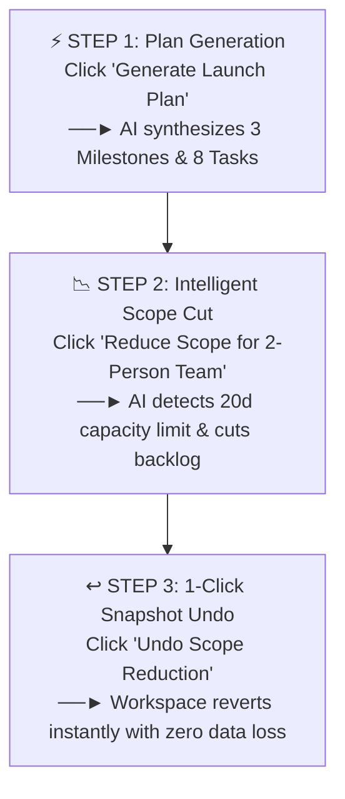

# ⚒️ Forge — The Dual-User Workspace for Humans & AI Agents

<div align="center">

```
  ███████╗ ██████╗ ██████╗  ██████╗ ███████╗
  ██╔════╝██╔═══██╗██╔══██╗██╔════╝ ██╔════╝
  █████╗  ██║   ██║██████╔╝██║  ███╗█████╗  
  ██╔══╝  ██║   ██║██╔══██╗██║   ██║██╔══╝  
  ██║     ╚██████╔╝██║  ██║╚██████╔╝███████╗
  ╚═╝      ╚═════╝ ╚═╝  ╚═╝ ╚═════╝ ╚══════╝
```

### **The Operating System where Humans and AI Agents work side-by-side as Equal Teammates**
*Humans set intent, review proposals, and maintain absolute safety. AI agents use browser-native WebMCP to plan, create, modify, and organize real workspace state.*

---

[](https://ais-dev-rimzuq4z4sbnw7cw77s5mi-191250814416.asia-southeast1.run.app)
[](https://github.com)
[](https://react.dev)
[](https://www.typescriptlang.org)
[](https://tailwindcss.com)

**[🚀 Try Live Workspace](https://ais-dev-rimzuq4z4sbnw7cw77s5mi-191250814416.asia-southeast1.run.app)** • **[⚡ 10-Second Visual Summary](#-what-is-forge-in-10-seconds)** • **[🆕 Recent Changes & Features](#-recent-updates--changelog)** • **[🛠️ 18 WebMCP Tools](#-the-18-webmcp-tools-catalog)** • **[🏆 Judge Walkthrough](#-evaluator--judge-hero-demo-walkthrough)**

---

</div>

## 📑 Table of Contents

1. [⚡ What is Forge in 10 Seconds?](#-what-is-forge-in-10-seconds)
2. [🆕 Recent Updates & Changelog](#-recent-updates--changelog)
3. [🗺️ Interactive Workspace Visual Layout](#-interactive-workspace-visual-layout)
4. [👥 The Dual-User Operating Model](#-the-dual-user-operating-model)
5. [📐 Visual Architecture & System Diagrams](#-visual-architecture--system-diagrams)
   - [Full System Topology](#full-system-topology)
   - [WebMCP Proposal & Safe Execution Flow](#webmcp-proposal--safe-execution-flow)
   - [Subsequence Fuzzy-Search Mechanism](#subsequence-fuzzy-search-mechanism)
   - [Zen Mode Distraction-Free Transformation](#zen-mode-distraction-free-transformation)
6. [🛠️ The 18 WebMCP Tools Catalog](#-the-18-webmcp-tools-catalog)
7. [🖥️ Workspace Views Deep Dive](#-workspace-views-deep-dive)
   - [1. Kanban Board with 3-Mode Horizontal Swimlanes](#1-kanban-board-with-3-mode-horizontal-swimlanes)
   - [2. Tabular Task List with Dynamic Columns](#2-tabular-task-list-with-dynamic-columns)
   - [3. Milestones & Phase Progress Tracking](#3-milestones--phase-progress-tracking)
   - [4. 2D Interactive Concept Canvas](#4-2d-interactive-concept-canvas)
   - [5. Technical Markdown PRD & Docs Vault](#5-technical-markdown-prd--docs-vault)
   - [6. Live WebMCP Protocol Inspector](#6-live-webmcp-protocol-inspector)
   - [7. 30-Day Task Velocity & Activity Analytics](#7-30-day-task-velocity--activity-analytics)
8. [♿ Productivity & Accessibility Systems](#-productivity--accessibility-systems)
   - [3-Tier Global Font Scaling (`compact`, `comfortable`, `spacious`)](#3-tier-global-font-scaling)
   - [Visual Last-Modified Timestamps Engine](#visual-last-modified-timestamps-engine)
   - [Voice-First Web Speech Orchestration](#voice-first-web-speech-orchestration)
   - [Visual Diff Proposal Modal](#visual-diff-proposal-modal)
   - [1-Click Cryptographic Undo](#1-click-cryptographic-undo)
   - [Global Command Palette (Ctrl+K / Cmd+K)](#global-command-palette-ctrlk--cmdk)
9. [🏆 Evaluator & Judge Hero Demo Walkthrough](#-evaluator--judge-hero-demo-walkthrough)
10. [⌨️ Keyboard Shortcuts Reference](#-keyboard-shortcuts-reference)
11. [📂 Repository Architecture](#-repository-architecture)
12. [🚀 Getting Started & Local Development](#-getting-started--local-development)
13. [🛡️ Security, Safety & Governance Guarantees](#-security-safety--governance-guarantees)

---

## ⚡ What is Forge in 10 Seconds?

Most project tools force humans to do 100% of the manual clicking, dragging, and ticket management. Chatbots, on the other hand, produce passive text that humans have to copy-paste.

**Forge merges both worlds into one unified collaborative canvas:**

```
           TRADITIONAL PM TOOLS                         ISOLATED CHATBOTS                               FORGE WORKSPACE
        (Jira, Trello, Linear)                         (ChatGPT, Claude)                     (Humans + AI Agents as Co-Workers)

   ┌──────────────────────────────┐              ┌──────────────────────────────┐              ┌──────────────────────────────┐
   │ 👤 Human does EVERYTHING     │              │ 🤖 AI writes text in a box   │              │ 👤 Human sets high-level goal│
   │                              │              │                              │              │           │                  │
   │ 🖱️ Manual ticket typing      │              │ 💬 Copy/paste code & plans   │              │           ▼                  │
   │ 🖱️ Manual status moving      │              │ ❌ Cannot touch workspace    │              │ 🤖 Agent inspects real state │
   │ 🖱️ Manual roadmap grooming   │              │ ❌ Hallucinates fake context │              │ 🤖 Agent proposes visual diff│
   │                              │              │                              │              │           │                  │
   │ ⏳ Hours wasted in meetings  │              │ 🚫 Zero workflow execution   │              │ 👤 Human clicks [Approve]   │
   └──────────────────────────────┘              └──────────────────────────────┘              │ ⚡ State mutates atomically  │
                                                                                               │ 📸 1-Click instant undo      │
                                                                                               └──────────────────────────────┘
```

---

## 🆕 Recent Updates & Changelog

| Feature | Category | Description | Visual Impact |
| :--- | :--- | :--- | :--- |
| **Fuzzy-Search Filter** | *Search & Discovery* | Multi-token subsequence matching across task titles, descriptions, assignees, IDs, and `#tags`. | Live counter pill (`Showing 3 of 10 tasks`), real-time highlights, instant `✕` clear. |
| **Zen Mode** | *Focus & Productivity* | One-click distraction-free toggle hiding navigation sidebars, agent sidepanel, and chrome. | Full-width workspace, floating HUD status bar, instant exit via `Esc` or button. |
| **3-Tier Font Size Mode** | *Accessibility* | Global font scaling context switching between **Compact (14px)**, **Comfortable (16px)**, and **Spacious (18px)**. | Persistent `localStorage` toggle with `Type` icon indicator (`A-`, `A`, `A+`). |
| **Visual 'Last Modified'** | *Audit & Context* | Live relative timestamps (`Just now`, `12m ago`, `Yesterday`) with formatted datetime tooltips. | Prominent clock badge on Kanban card headers/footers and Task List table column. |
| **Horizontal Swimlanes** | *Workflow Layout* | Dynamic row grouping by **Project Phase (Milestones)** or **Urgency Level (Priorities)**. | Expandable/collapsible horizontal swimlane rows with sub-totals and progress bars. |
| **Hero Demo Walkthrough** | *Evaluation Mode* | 3-step automated tour guiding judges through Plan Generation, Scope Reduction, and 1-Click Undo. | Step banner with direct actions and live visual state updates. |

---

## 🗺️ Interactive Workspace Visual Layout

Below is an exact visual ASCII schematic of Forge's dual-user interface:

```
┌─────────────────────────────────────────────────────────────────────────────────────────────────────────────────────────────┐
│ ⚒️ FORGE  [Hero Roadmap ▾] [⚡ WebMCP: Ready]   [Kanban] [List] [Milestones] [Canvas] [Docs] [Inspector]  [A] [Zen] [🌙] [Hero Demo] │
├───────────────────────────────────────────────────────────────────────────────────────────────────┬─────────────────────────┤
│                                     PRIMARY WORKSPACE CANVAS                                      │     🤖 AGENT COPILOT    │
│                                                                                                   ├─────────────────────────┤
│  🔍 [Fuzzy Search: "dep prx"            ✕]  Group: [Standard] [Phase] [Urgency]  [+ New Task]     │ 🎙️ Voice: [Tap to Talk] │
│  ┌─────────────────────────────────────────────────────────────────────────────────────────────┐  │  "I need an emergency  │
│  │ ⚡ Active Filter: Showing 2 of 9 active tasks matching "dep prx"             [Clear Filter] │  │  scope reduction plan" │
│  └─────────────────────────────────────────────────────────────────────────────────────────────┘  │                         │
│                                                                                                   │ ┌─────────────────────┐ │
│  ┌──────────────────────────────┬──────────────────────────────┬──────────────────────────────┐   │ │ 💡 Proposal #P-104  │ │
│  │ 📋 TO DO (2)                 │ ⏳ IN PROGRESS (1)           │ ✅ DONE (3)                  │   │ │ Scope Down - 14 Days│ │
│  ├──────────────────────────────┼──────────────────────────────┼──────────────────────────────┤   │ │ - 2 features cut    │ │
│  │ [URGENT] TASK-1  ⏱️ 2m ago   │ [HIGH] TASK-3    ⏱️ 15m ago  │ [DONE] TASK-2    ⏱️ 1d ago   │   │ │ + 3 tasks re-routed │ │
│  │ Deploy Edge Reverse Proxy    │ WebMCP Bus Client Listener   │ Seed JSON Schema Fixtures    │   │ │ [Review Diff]       │ │
│  │ 👤 Founder A  ·  2d estimate │ 👤 Founder B  ·  3d estimate │ 👤 Founder A  ·  1d estimate │   │ └─────────────────────┘ │
│  │ 🏷️ #infrastructure #edge     │ 🏷️ #webmcp #realtime         │ 🏷️ #database #schemas        │   │                         │
│  │ [✓ 2/3 Subtasks] [▶ Timer]   │ [✓ 1/2 Subtasks] [▶ Timer]   │ [✓ 4/4 Subtasks] [Archive]   │   │ 💬 Chat History:        │
│  └──────────────────────────────┴──────────────────────────────┴──────────────────────────────┘   │ • Agent: State fetched  │
├───────────────────────────────────────────────────────────────────────────────────────────────────┤ • Agent: Proposing diff │
│ ⚡ WebMCP Bus: 18 Tools Active  •  📸 Snapshot Stack: 4 Available  •  [↩️ 1-Click Undo]              │ [Type prompt or tool...]│
└───────────────────────────────────────────────────────────────────────────────────────────────────┴─────────────────────────┘
```

---

## 👥 The Dual-User Operating Model

In Forge, an AI Agent is not a peripheral chat addon—it is an **authenticated co-worker** connected to the browser's execution bus:

```mermaid
graph LR
    subgraph HumanRights ["👤 Human Rights"]
        H1[Set Strategic Intent]
        H2[Inspect Visual Diff Modals]
        H3[Approve / Reject Operations]
        H4[1-Click Cryptographic Undo]
        H5[Voice & Tactile Drag-and-Drop]
    end

    subgraph SharedBus ["⚡ Shared WebMCP Runtime (`window.document.modelContext`)"]
        B1[Real-Time State Serializer]
        B2[18 Validated Schema Tools]
        B3[Deterministic Snapshot Stack]
    end

    subgraph AgentRights ["🤖 AI Agent Rights"]
        A1[Query Backlog & Capacity]
        A2[Calculate Velocity Limits]
        A3[Synthesize Multi-Phase Plans]
        A4[Batch-Create & Tag Tasks]
        A5[Update 2D Canvas & Docs]
    end

    HumanRights <---> SharedBus
    SharedBus <---> AgentRights
```



---

## 📐 Visual Architecture & System Diagrams

### Full System Topology



---

### WebMCP Proposal & Safe Execution Flow



---

### Subsequence Fuzzy-Search Mechanism

Forge implements an intelligent subsequence matcher (`matchesTaskFuzzy` in `/src/utils/taskFilters.ts`) that matches character sequences even when separated by spaces, dashes, or words:

```
User types query: "dep prx"

1. Query Tokenization:  ["dep", "prx"]
2. Target String:       "TASK-1: Deploy Edge Reverse Proxy #infrastructure"
3. Subsequence Check:
   Token 1 ("dep"):     [Dep]loy Edge Reverse Proxy  ──────► MATCH (Index 8-10)
   Token 2 ("prx"):     Deploy Edge Reverse [Pr]o[x]y ─────► MATCH (P...r...x)
4. Result:              ✅ MATCHED (Ranked high, displayed instantly)
```



---

### Zen Mode Distraction-Free Transformation

Zen Mode eliminates visual noise so you can focus on pure execution:

```
               STANDARD MODE (Full Chrome)                                           ZEN MODE (Distraction-Free)

┌────────────────────────────────────────────────────────┐          ┌────────────────────────────────────────────────────────┐
│ [Top Navigation Bar: Views, Theme, Font, Hero Demo]   │          │                                                        │
├───────────────────┬────────────────┬───────────────────┤          │                                                        │
│ 📁 Nav Sidebar    │ 📋 Kanban Board│ 🤖 Agent Copilot  │  ──────► │                  📋 KANBAN BOARD / VIEW                │
│ • Projects        │ • Swimlanes    │ • Voice input     │          │                  (Expanded to Full 100% Width)         │
│ • Views           │ • Cards        │ • Proposals       │          │                                                        │
│ • Settings        │ • Metrics      │ • Chat history    │          │                                                        │
├───────────────────┴────────────────┴───────────────────┤          │                                                        │
│ 📊 Bottom Status & Snapshot Bar                        │          │       [ 🟢 Zen Active • Press Esc to Exit ]            │
└────────────────────────────────────────────────────────┘          └────────────────────────────────────────────────────────┘
```

---

## 🛠️ The 18 WebMCP Tools Catalog

Every tool is strictly registered on `window.document.modelContext` with typed input and output schemas:

```
┌─────────────────────────────────────────────────────────────────────────────────────────────────────────┐
│                                       18 REGISTERED WEBMCP TOOLS                                        │
├──────────────────────────┬──────────────────────────┬──────────────────────────┬────────────────────────┤
│ 🔍 QUERY & ANALYSIS      │ 📋 TASK LIFECYCLE        │ 🗺️ ROADMAP & CANVAS     │ 🛡️ SAFETY & GOVERNANCE │
├──────────────────────────┼──────────────────────────┼──────────────────────────┼────────────────────────┤
│ • get_project_state      │ • create_task            │ • create_milestone       │ • generate_plan        │
│ • analyze_project        │ • update_task            │ • update_milestone       │ • propose_changes      │
│                          │ • delete_task            │ • create_canvas_node     │ • apply_proposal       │
│                          │ • batch_create_tasks     │ • update_canvas_node     │ • reject_proposal      │
│                          │ • archive_task           │ • delete_canvas_node     │ • undo_changes         │
│                          │                          │ • create_document        │                        │
│                          │                          │ • update_document        │                        │
└──────────────────────────┴──────────────────────────┴──────────────────────────┴────────────────────────┘
```

### Complete Technical Specification Table

| # | Tool Identifier | Input Parameters | Return Object | Operational Description |
| :- | :--- | :--- | :--- | :--- |
| **1** | `get_project_state` | `{}` | `WorkspaceState` | Serializes complete project: tasks, milestones, canvas nodes, markdown docs, and telemetry. |
| **2** | `analyze_project` | `{}` | `AnalyticsSummary` | Computes velocity burndown, completion rates, bottleneck alerts, and team capacity. |
| **3** | `create_task` | `title, priority, assignee, estimateDays, dueDate, tags` | `{ task: Task }` | Creates a new task with unique ID, ISO timestamps, default status `todo`, and relative tags. |
| **4** | `update_task` | `taskId, status?, priority?, assignee?, title?, ...` | `{ task: Task }` | Updates any field on a task, automatically stamps `updatedAt`, and triggers reactive UI re-render. |
| **5** | `delete_task` | `taskId` | `{ success: boolean }` | Safely removes task after taking an internal undo snapshot. |
| **6** | `batch_create_tasks`| `tasks: TaskInput[]` | `{ tasks: Task[] }` | Atomically creates multiple tasks at once during roadmap generation. |
| **7** | `archive_task` | `taskId, unarchive?` | `{ task: Task }` | Toggles archival state; removes clutter from active board without destroying records. |
| **8** | `create_milestone` | `title, targetDate, description, deliverables[]` | `{ milestone: Milestone }` | Adds a strategic phase with target milestones and percentage completion meters. |
| **9** | `update_milestone` | `milestoneId, status?, progress?, targetDate?` | `{ milestone: Milestone }`| Adjusts milestone status (`upcoming`, `in_progress`, `completed`) and deliverables. |
| **10**| `create_canvas_node`| `type, label, x, y, color, content` | `{ node: CanvasNode }` | Adds an interactive 2D spatial card to the infinite concept canvas. |
| **11**| `update_canvas_node`| `nodeId, x?, y?, label?, content?, color?` | `{ node: CanvasNode }` | Modifies position coordinates or text content of a canvas node. |
| **12**| `delete_canvas_node`| `nodeId` | `{ success: boolean }` | Removes a canvas node and cleans up connected relationship edges. |
| **13**| `create_document` | `title, content, tags[]` | `{ doc: Document }` | Creates a new technical markdown specification or engineering PRD. |
| **14**| `update_document` | `documentId, title?, content?` | `{ doc: Document }` | Updates markdown document content with live word-count calculations. |
| **15**| `generate_plan` | `goal, timeframeDays, teamSize, focusAreas[]` | `{ plan: PlanProposal }`| AI synthesizes a full multi-tier roadmap with milestones, tasks, and effort distributions. |
| **16**| `propose_changes` | `title, description, patch[]` | `{ proposal: Proposal }`| Triggers the Visual Diff Proposal modal requiring human approval before mutation. |
| **17**| `apply_proposal` | `proposalId` | `{ success: boolean }` | Captures an immutable snapshot, applies proposal patch atomically, and logs telemetry. |
| **18**| `reject_proposal` | `proposalId` | `{ success: boolean }` | Declines proposal and discards pending patch with zero state modification. |
| **19**| `undo_changes` | `{}` | `{ restored: boolean }` | Restores previous workspace snapshot from the stack (zero-data-loss rollback). |

---

### Executing Tools via Developer Console or Headless Agents

Any headless agent or browser automation script can query and control Forge via standard JavaScript:

```javascript
// Check all registered capabilities
const tools = await window.document.modelContext.listTools();
console.table(tools.map(t => ({ Name: t.name, Description: t.description })));

// Run automated health check
const analysis = await window.document.modelContext.execute("analyze_project", {});
console.log("Team Velocity:", analysis.velocity, "Bottlenecks:", analysis.bottlenecks);

// Batch-create tasks from an external pipeline
await window.document.modelContext.execute("batch_create_tasks", {
  tasks: [
    { title: "Implement Auth Middleware", priority: "urgent", assignee: "Founder A", estimateDays: 2 },
    { title: "Design Landing Page Hero", priority: "high", assignee: "Founder B", estimateDays: 3 }
  ]
});
```

---

## 🖥️ Workspace Views Deep Dive

### 1. Kanban Board with 3-Mode Horizontal Swimlanes

```
┌────────────────────────────────────────────────────────────────────────────────────────────────────────┐
│  SWIMLANE MODE: [Project Phase]                                         [🔍 Fuzzy Filter...]  [+ Task] │
├────────────────────────────────────────────────────────────────────────────────────────────────────────┤
│  ▼ PHASE 1: CORE INFRASTRUCTURE (Progress: 66%  •  3 tasks  •  5 days estimated)                      │
│  ┌───────────────────────┬───────────────────────┬───────────────────────┬──────────────────────────┐  │
│  │ TO DO (1)             │ IN PROGRESS (1)       │ REVIEW (0)            │ DONE (1)                 │  │
│  ├───────────────────────┼───────────────────────┼───────────────────────┼──────────────────────────┤  │
│  │ [URGENT] TASK-1       │ [HIGH] TASK-3         │ (Empty)               │ [DONE] TASK-2            │  │
│  │ Deploy Edge Proxy     │ WebMCP Bus Client     │                       │ Seed Schemas             │  │
│  │ ⏱️ 5m ago  ·  2d      │ ⏱️ 1h ago  ·  2d      │                       │ ⏱️ 1d ago  ·  1d         │  │
│  └───────────────────────┴───────────────────────┴───────────────────────┴──────────────────────────┘  │
│  ▼ PHASE 2: LAUNCH & SCALE (Progress: 0%  •  2 tasks  •  6 days estimated)                            │
│  ┌───────────────────────┬───────────────────────┬───────────────────────┬──────────────────────────┐  │
│  │ TO DO (2)             │ IN PROGRESS (0)       │ REVIEW (0)            │ DONE (0)                 │  │
│  │ ...                   │                       │                       │                          │  │
│  └───────────────────────┴───────────────────────┴───────────────────────┴──────────────────────────┘  │
└────────────────────────────────────────────────────────────────────────────────────────────────────────┘
```

- **3 Dynamic Swimlane Modes**:
  - **Standard Columns**: Flat 4-column layout (`To Do`, `In Progress`, `Review`, `Done`).
  - **Project Phase Swimlanes**: Horizontal swimlanes dynamically grouped by active Milestones.
  - **Urgency Level Swimlanes**: Horizontal swimlanes grouped by Priority (`Urgent`, `High`, `Medium`, `Low`).
- **Tactile Card Controls**:
  - Drag-and-drop between columns and across swimlanes.
  - Inline title and estimate editing directly on the card.
  - Checkbox subtask checklist with live completion ratio (`✓ 2/3`).
  - Integrated stopwatch timer with start/stop toggle.
  - Relative elapsed timestamp badge (`⏱️ 4m ago`) and priority color border accents.

---

### 2. Tabular Task List with Dynamic Columns

```
┌────────────────────────────────────────────────────────────────────────────────────────────────────────────────────────┐
│ Status: [All (9)] [To Do (3)] [In Progress (2)] [Done (4)]      Priority: [All] [Urgent] [High]   [🔍 Filter tasks...] │
├────┬──────────┬─────────────────────────────────────┬─────────────┬──────────┬──────────────┬─────────────┬────────────┤
│ ST │ ID       │ TITLE & TAGS                        │ STATUS      │ PRIORITY │ ASSIGNEE     │ LAST MOD    │ ESTIMATE   │
├────┼──────────┼─────────────────────────────────────┼─────────────┼──────────┼──────────────┼─────────────┼────────────┤
│ [ ]│ TASK-1   │ Deploy Edge Reverse Proxy           │ To Do       │ 🔴 Urgent│ Founder A    │ ⏱️ 2m ago   │ 2 days     │
│    │          │ #infrastructure #edge #security     │             │          │              │             │            │
│ [ ]│ TASK-3   │ WebMCP Protocol Bus Listener        │ In Progress │ 🟠 High  │ Founder B    │ ⏱️ 15m ago  │ 3 days     │
│    │          │ #webmcp #realtime #bus              │             │          │              │             │            │
│ [x]│ TASK-2   │ Seed JSON Schema Fixtures           │ Done        │ 🟢 Medium│ Founder A    │ ⏱️ 1d ago   │ 1 day      │
│    │          │ #database #schemas                  │             │          │              │             │            │
└────┴──────────┴─────────────────────────────────────┴─────────────┴──────────┴──────────────┴─────────────┴────────────┘
```

- **Full-Text Fuzzy Filtering**: Instant multi-token search across all columns simultaneously.
- **Dedicated Last-Modified Column**: Live updated relative timestamps with tooltips displaying full formatted date-time.
- **Fast Action Toolbar**: Quick batch archive, status toggle, and priority adjustments.

---

### 3. Milestones & Phase Progress Tracking

- **Gantt-Style Visual Timelines**: Clear delivery indicators and milestone dates.
- **Calculated Completion Meters**: Deterministically computed from the ratio of completed child tasks.
- **Phase Deliverables Checklist**: Interactive milestones with progress indicators.

---

### 4. 2D Interactive Concept Canvas

- **Free-Form Spatial Node Graph**: Arrange architecture concepts, sticky notes, and trigger events.
- **Agent Integration**: Agents can generate and update nodes via `create_canvas_node` and `update_canvas_node`.
- **Node Classification**: Visual styles for concepts, architectural decisions, and data pipelines.

---

### 5. Technical Markdown PRD & Docs Vault

- **Full Markdown Rendering**: Code blocks, markdown tables, callout blocks, and lists.
- **Live Telemetry Bar**: Real-time word count, character count, and reading time estimation.
- **Agent Accessible**: AI agents can read and write technical specifications via WebMCP.

---

### 6. Live WebMCP Protocol Inspector

- **Interactive Sandbox**: Manually execute any of the 18 WebMCP tools with custom JSON payloads.
- **Schema Visualizer**: Expandable parameter trees documenting types, defaults, and requirements.
- **Chronological Telemetry Stream**: Real-time log showing execution timestamps, caller sources, execution duration (ms), and return values.

---

### 7. 30-Day Task Velocity & Activity Analytics

- **Recharts Burndown Chart**: Visual comparison of planned sprint velocity versus actual completed work.
- **Human vs. Agent Contribution Split**: Quantifies productivity contributions by source.
- **Urgency Distribution**: Breakdown of urgent, high, medium, and low priority workloads.

---

## ♿ Productivity & Accessibility Systems

### 3-Tier Global Font Scaling

Forge features a global font scaling engine managed in `ThemeContext` and applied via CSS variables at the HTML root:

| Mode Identifier | Root Font Size | Target Screen & Use Case | Toggle Control |
| :--- | :--- | :--- | :--- |
| **`font-compact`** | `14px` (0.875rem) | 4K displays, dense sprint planning, high-information tables | `[A-]` in header |
| **`font-comfortable`** | `16px` (1.000rem) | Standard displays, everyday balance of density and readability | `[A]` in header |
| **`font-spacious`** | `18px` (1.125rem) | Presentations, accessibility needs, relaxed reading | `[A+]` in header |

```css
/* Configured dynamically in index.css */
html.font-compact { font-size: 14px; }
html.font-comfortable { font-size: 16px; }
html.font-spacious { font-size: 18px; }
```

---

### Visual Last-Modified Timestamps Engine

Every state mutation in Forge—whether caused by human dragging, inline editing, subtask completion, or WebMCP tool execution—updates an ISO 8601 `updatedAt` timestamp.

The utility `/src/utils/taskFilters.ts` formats this timestamp relative to the current time:

```
Elapsed < 1 min   ──► "Just now"
Elapsed < 60 min  ──► "Xm ago"   (e.g., "12m ago")
Elapsed < 24 hrs  ──► "Xh ago"   (e.g., "3h ago")
Elapsed < 48 hrs  ──► "Yesterday"
Elapsed >= 2 days ──► "Xd ago"   (e.g., "4d ago")
```

Hovering over any timestamp displays a native browser tooltip with the exact full date and time (e.g., `Last modified: Friday, September 11, 2026 at 10:45 AM`).

---

### Voice-First Web Speech Orchestration

- **Browser-Native Web Speech**: Zero external dependencies, zero latency.
- **Real-Time Visualizer**: Animated waveform indicating `Listening...` and `Processing...` states.
- **Speech Synthesis (TTS)**: Spoken audio confirmation when agent actions complete.

---

### Visual Diff Proposal Modal

When the agent proposes high-impact changes (e.g., reducing project scope), it cannot execute them without human approval:

```
┌────────────────────────────────────────────────────────────────────────────────────────┐
│ 🪟 PROPOSAL REVIEW: "14-Day Scope Cut & Sprint Re-Alignment"               [✕ Close]   │
├────────────────────────────────────────────────────────────────────────────────────────┤
│ The AI Agent suggests removing 2 low-priority tasks and re-assigning urgent deadlines: │
│                                                                                        │
│   ❌ REMOVED FROM SCOPE:                                                               │
│   • TASK-8: "Build Dark Mode Theme Playground" (Effort: 3 days, Priority: Low)        │
│   • TASK-9: "Integrate Third-Party Webhook Relays" (Effort: 4 days, Priority: Low)    │
│                                                                                        │
│   🔄 ADJUSTED ESTIMATES:                                                               │
│   • TASK-1: "Deploy Edge Reverse Proxy" (Estimated 3d ──► 2d)                          │
│                                                                                        │
│   📊 CAPACITY IMPACT: Total backlog reduced from 29 days ──► 18 days (Achievable!)     │
├────────────────────────────────────────────────────────────────────────────────────────┤
│ [❌ Reject Proposal]                                              [✅ Approve & Apply] │
└────────────────────────────────────────────────────────────────────────────────────────┘
```

---

### 1-Click Cryptographic Undo

Before applying any approved proposal or destructive edit, Forge captures a snapshot:

```typescript
const previousState = JSON.parse(JSON.stringify(workspaceState));
snapshotStack.push({
  timestamp: new Date().toISOString(),
  description: proposal.title,
  state: previousState
});
```

Clicking **`[↩️ Undo]`** pops the top snapshot and restores the exact previous workspace state with zero data corruption.

---

### Global Command Palette (Ctrl+K / Cmd+K)

- Search all tasks, milestones, canvas notes, and documents simultaneously.
- Jump directly between workspace views.
- Trigger instant actions (`New Task`, `Toggle Zen Mode`, `Cycle Font Size`).

---

## 🏆 Evaluator & Judge Hero Demo Walkthrough

Click the **"Hero Demo"** button in the top navigation header to run this interactive 3-step tour:



1. **Step 1 — Plan Generation**:
   The agent queries the current project state via WebMCP, identifies missing launch phases, and creates a realistic multi-tier plan with milestones, deliverables, and assigned tasks.
2. **Step 2 — Intelligent Scope Reduction**:
   The evaluator asks the agent to fit the plan into a 2-person, 14-day window. The agent calculates that 2 people working 10 business days have 20 person-days of capacity. It identifies non-critical features, generates a structured diff proposal, and presents the visual comparison modal.
3. **Step 3 — 1-Click Undo**:
   With one click, the evaluator reverts the proposal using Forge's snapshot stack, demonstrating complete safety and zero data loss.

---

## ⌨️ Keyboard Shortcuts Reference

| Shortcut | Action | Scope |
| :--- | :--- | :--- |
| `Ctrl+K` / `Cmd+K` | Open Global Command Palette | Global |
| `Ctrl+P` / `Cmd+P` | Open Pending Diff Proposal Modal | Global |
| `Escape` | Exit Zen Mode / Dismiss Modals | Global |
| `Enter` | Save Inline Task Edit / Send Chat Prompt | Forms & Cards |
| `Space` (when focused) | Toggle Task Status (To Do ⟷ Done) | Kanban & Task List |

---

## 📂 Repository Architecture

```
forge/
├── .env.example                       # Environment variables (GEMINI_API_KEY)
├── metadata.json                      # AI Studio capabilities and frame permissions
├── package.json                       # React 19, Tailwind CSS v4, Lucide, Recharts
├── tsconfig.json                      # Strict TypeScript compiler options
├── vite.config.ts                     # Vite build configuration with Tailwind plugin
│
├── public/                            # Static public assets and icons
│
└── src/
    ├── main.tsx                       # React DOM root entry point
    ├── App.tsx                        # Master layout, Zen Mode, shortcuts & navigation orchestrator
    ├── index.css                      # Tailwind CSS v4 entry point & font size mode variables
    │
    ├── types/
    │   └── forge.ts                   # Core TypeScript interfaces: Task, Milestone, Proposal, WebMCP
    │
    ├── context/
    │   ├── WorkspaceContext.tsx       # Central state store, snapshot stack, and WebMCP registry
    │   └── ThemeContext.tsx           # Dark/Light theme & Compact/Comfortable/Spacious font scaling
    │
    ├── utils/
    │   └── taskFilters.ts             # Subsequence fuzzy search & relative time formatters
    │
    └── components/
        ├── Navigation.tsx             # Top header with view switcher, Zen toggle, theme & font controls
        ├── AgentPanel.tsx             # Integrated AI copilot panel with Web Speech voice visualizer
        ├── ProposalModal.tsx          # Visual diff inspector for approving/rejecting agent proposals
        ├── CommandPaletteModal.tsx    # Global Ctrl+K full-text search and quick-action menu
        ├── DashboardAnalyticsOverlay.tsx # 30-day task velocity and agent burndown visualizer
        ├── TaskCardModal.tsx          # Rich modal with subtask checklists and custom date picker
        ├── TaskTimerTracker.tsx       # Live task time tracking widget
        ├── DashboardSummary.tsx       # Top Kanban sprint metrics summary card
        │
        └── views/
            ├── KanbanBoardView.tsx    # Drag-and-drop board with horizontal swimlanes & fuzzy search
            ├── TaskListView.tsx       # Dense tabular task list with last-modified timestamps
            ├── MilestonesView.tsx     # Gantt-style phase progress tracker
            ├── CanvasView.tsx         # 2D visual concept node workspace
            ├── DocumentsView.tsx      # Markdown technical documentation wiki
            └── WebMcpInspector.tsx    # Live WebMCP tool schema browser and execution runner
```

---

## 🚀 Getting Started & Local Development

### Prerequisites

- **Node.js**: Version 18.0.0 or higher
- **npm** or **bun**: Modern package manager

### Setup Instructions

1. **Clone and Install Dependencies**:
   ```bash
   git clone https://github.com/your-org/forge.git
   cd forge
   npm install
   ```

2. **Configure Environment Variables**:
   ```bash
   cp .env.example .env
   # Add your Gemini API key (optional for server-side AI features):
   # GEMINI_API_KEY=your_key_here
   ```

3. **Start Development Server** (Binds to `http://localhost:3000`):
   ```bash
   npm run dev
   ```

4. **Verify TypeScript & Build**:
   ```bash
   npm run lint
   npm run build
   ```

---

## 🛡️ Security, Safety & Governance Guarantees

1. **No Silent Mutations**: High-impact agent actions are staged into a `DiffProposal` that requires explicit human modal confirmation.
2. **Immutable Snapshot Stack**: Before any state patch is committed, the previous workspace state is cloned and stored in memory. The human can click `Undo` at any time.
3. **Browser Protocol Sandbox**: External callers communicating via `window.document.modelContext` are strictly bound to validated JSON Schemas.
4. **Secret Isolation**: All API credentials (such as `GEMINI_API_KEY`) run server-side and are never leaked to client bundles.

---

<div align="center">

**Built for the future where humans and AI agents work together as genuine teammates.**

*Forge • The Dual-User Workspace*

</div>
