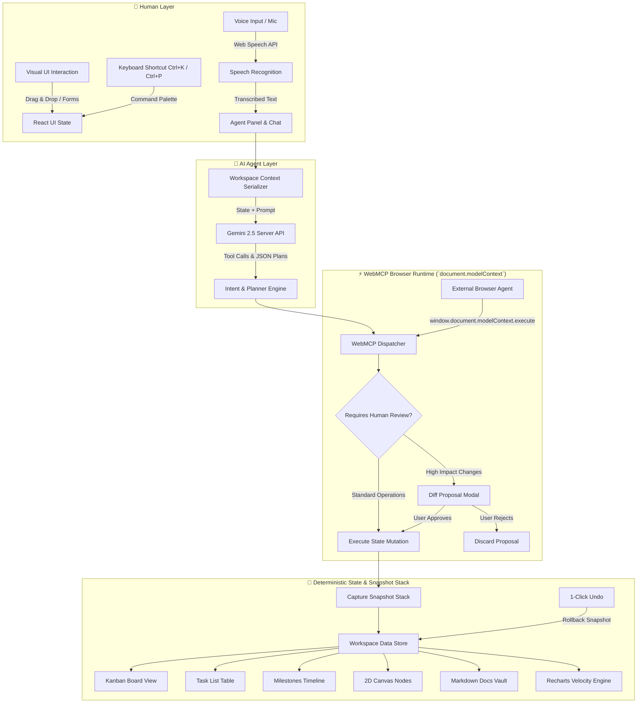
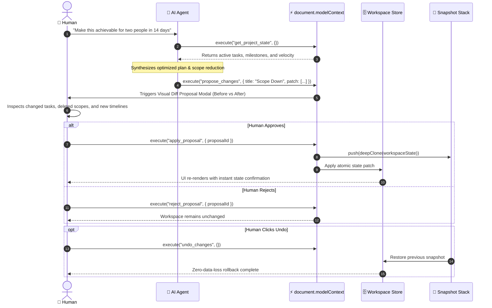

# ⚒️ Forge — The Dual-User Workspace for Humans & AI Agents

<div align="center">

```
  ███████╗ ██████╗ ██████╗  ██████╗ ███████╗
  ██╔════╝██╔═══██╗██╔══██╗██╔════╝ ██╔════╝
  █████╗  ██║   ██║██████╔╝██║  ███╗█████╗  
  ██╔══╝  ██║   ██║██╔══██╗██║   ██║██╔══╝  
  ██║     ╚██████╔╝██║  ██║╚██████╔╝███████╗
  ╚═╝      ╚═════╝ ╚═╝  ╚═╝ ╚═════╝ ╚══════╝
```

**A high-velocity collaborative operating system built for two first-class citizens: humans and AI agents.**  
*Humans set intent, review proposals, and maintain absolute governance. AI agents use browser-native WebMCP to plan, create, modify, and organize real workspace data under complete human control.*

---

[](https://github.com)
[](https://react.dev)
[](https://www.typescriptlang.org)
[](https://tailwindcss.com)
[](https://vitejs.dev)
[](LICENSE)

[Live Applet](https://ais-dev-rimzuq4z4sbnw7cw77s5mi-191250814416.asia-southeast1.run.app) • [Architecture Overview](#-architecture--system-design) • [WebMCP Tool Catalog](#-the-18-webmcp-tools-catalog) • [Interactive Views](#-workspace-views--features) • [Walkthrough Demo](#-judge--evaluator-walkthrough)

---

</div>

## 📑 Table of Contents

- [The Dual-User Paradigm](#-the-dual-user-paradigm)
- [Architecture & System Design](#-architecture--system-design)
  - [High-Level Flowchart](#high-level-flowchart)
  - [WebMCP Execution & Proposal Flow](#webmcp-execution--proposal-flow)
- [The 18 WebMCP Tools Catalog](#-the-18-webmcp-tools-catalog)
  - [Browser Agent Integration (`document.modelContext`)](#browser-agent-integration-documentmodelcontext)
- [Workspace Views & Features](#-workspace-views--features)
  - [1. Kanban Board (with Horizontal Swimlanes)](#1-kanban-board-with-horizontal-swimlanes)
  - [2. Structured Task List View](#2-structured-task-list-view)
  - [3. Milestones & Phase Progress](#3-milestones--phase-progress)
  - [4. 2D Interactive Concept Canvas](#4-2d-interactive-concept-canvas)
  - [5. Markdown Document & PRD Vault](#5-markdown-document--prd-vault)
  - [6. Live WebMCP Inspector](#6-live-webmcp-inspector)
  - [7. 30-Day Task Velocity & Activity Analytics](#7-30-day-task-velocity--activity-analytics)
- [Productivity & Accessibility Systems](#-productivity--accessibility-systems)
  - [Fuzzy-Search Subsequence Engine](#fuzzy-search-subsequence-engine)
  - [Zen Mode (Distraction-Free Focus)](#zen-mode-distraction-free-focus)
  - [Global 3-Tier Font Size Scaling](#global-3-tier-font-size-scaling)
  - [Voice-First Agent Orchestration](#voice-first-agent-orchestration)
  - [Diff Proposals & 1-Click Snapshot Rollbacks](#diff-proposals--1-click-snapshot-rollbacks)
  - [Command Palette (Ctrl+K / Cmd+K)](#command-palette-ctrlk--cmdk)
- [Judge & Evaluator Walkthrough](#-judge--evaluator-walkthrough)
- [Keyboard Shortcuts Cheatsheet](#-keyboard-shortcuts-cheatsheet)
- [Directory Structure](#-directory-structure)
- [Getting Started & Development](#-getting-started--development)
- [Security & Deterministic Safety](#-security--deterministic-safety)

---

## 👥 The Dual-User Paradigm

Traditional project management tools are designed exclusively for human cursor clicks and manual form entry. Conversely, standalone chatbot interfaces trap AI capabilities inside passive chat bubbles that cannot directly interact with application state.

**Forge collapses this divide by treating both humans and autonomous AI agents as equal, synchronized users sharing one live workspace:**

```
┌─────────────────────────────────────────────────────────────────────────────┐
│                                FORGE WORKSPACE                              │
│                                                                             │
│   ┌───────────────────────────┐             ┌───────────────────────────┐   │
│   │        HUMAN USER         │             │      AI AGENT USER        │   │
│   ├───────────────────────────┤             ├───────────────────────────┤   │
│   │ • Defines intent & goals  │             │ • Inspects real schemas   │   │
│   │ • Reviews diff proposals  │ ◄─────────► │ • Synthesizes plans       │   │
│   │ • Approves / rejects ops  │             │ • Invokes WebMCP tools    │   │
│   │ • 1-Click snapshot undo   │             │ • Batch-creates tasks     │   │
│   │ • Speaks via Web Speech   │             │ • Updates visual canvas   │   │
│   └───────────────────────────┘             └───────────────────────────┘   │
│                 │                                         │                 │
│                 ▼                                         ▼                 │
│   ┌─────────────────────────────────────────────────────────────────────┐   │
│   │            REACTIVE STATE & WEBMCP BROWSER BUS (`window`)            │   │
│   │  Tasks • Milestones • 2D Canvas • Markdown Docs • Snapshot Stack   │   │
│   └─────────────────────────────────────────────────────────────────────┘   │
└─────────────────────────────────────────────────────────────────────────────┘
```

| Dimension | Legacy Tools (Jira, Linear) | Generic Chatbots (ChatGPT, Claude) | **Forge** |
| :--- | :--- | :--- | :--- |
| **User Archetype** | Human-only | Human typing to text model | **Human + Agent Co-workers** |
| **Agent Actionability** | Read-only API or third-party webhooks | Hallucinated markdown text | **Browser-Native WebMCP Tools** |
| **Governance** | Manual ticket creation | None (user must copy/paste) | **Visual Diff Proposal Modal** |
| **Safety & Audit** | Database audit logs | None | **1-Click Cryptographic Undo** |
| **Interaction Modalities** | Mouse & Keyboard only | Typing only | **Voice, Text, Drag-and-Drop, CLI** |

---

## 📐 Architecture & System Design

### High-Level Flowchart

Forge runs entirely within a high-performance, reactive React 19 + TypeScript architecture with server-side Gemini AI assistance and client-side WebMCP tool bus execution:



### WebMCP Execution & Proposal Flow



---

## 🛠️ The 18 WebMCP Tools Catalog

Forge registers **18 production-grade WebMCP tools** directly onto `window.document.modelContext`. Each tool includes a strict JSON Schema, deterministic parameter validation, and telemetry logging:

```
┌─────────────────────────────────────────────────────────────────────────────┐
│                       18 REGISTERED WEBMCP TOOLS                            │
├───────────────────┬─────────────────────────────────────────────────────────┤
│ Workspace Query   │ • get_project_state    • analyze_project                │
├───────────────────┼─────────────────────────────────────────────────────────┤
│ Task Management   │ • create_task          • update_task                    │
│                   │ • delete_task          • batch_create_tasks             │
│                   │ • archive_task                                          │
├───────────────────┼─────────────────────────────────────────────────────────┤
│ Milestone Engine  │ • create_milestone     • update_milestone               │
├───────────────────┼─────────────────────────────────────────────────────────┤
│ Visual Canvas     │ • create_canvas_node   • update_canvas_node             │
│                   │ • delete_canvas_node                                    │
├───────────────────┼─────────────────────────────────────────────────────────┤
│ Documentation     │ • create_document      • update_document                │
├───────────────────┼─────────────────────────────────────────────────────────┤
│ AI Governance     │ • generate_plan        • propose_changes                │
│                   │ • apply_proposal       • reject_proposal                │
│                   │ • undo_changes                                          │
└───────────────────┴─────────────────────────────────────────────────────────┘
```

### Detailed Tool Specification

| Tool Name | Parameters | Purpose & Description |
| :--- | :--- | :--- |
| `get_project_state` | *None* | Serializes entire workspace state: tasks, milestones, canvas nodes, documents, and snapshots. |
| `analyze_project` | *None* | Calculates velocity, completion percentages, urgency distributions, and bottleneck tasks. |
| `create_task` | `title`, `priority`, `assignee`, `estimateDays`, `dueDate`, `tags` | Creates a new task with unique ID, ISO timestamps, and placement in the active backlog. |
| `update_task` | `taskId`, `status`, `priority`, `assignee`, `title`, `description`, etc. | Mutates existing task fields, updates `updatedAt` relative timestamp, and triggers UI updates. |
| `delete_task` | `taskId` | Permanently removes a task from the active board after snapshot preservation. |
| `batch_create_tasks` | `tasks[]` | Atomically creates multiple tasks at once (used during roadmap plan generation). |
| `archive_task` | `taskId`, `unarchive?` | Toggles archival state to keep the active board clean without deleting historical records. |
| `create_milestone` | `title`, `targetDate`, `description`, `deliverables[]` | Defines a project phase with progress metrics and target completion dates. |
| `update_milestone` | `milestoneId`, `status`, `progress`, `targetDate` | Updates milestone lifecycle status (`upcoming`, `in_progress`, `completed`). |
| `create_canvas_node` | `type`, `label`, `x`, `y`, `color`, `content` | Spawns interactive 2D canvas nodes (cards, notes, concepts, triggers). |
| `update_canvas_node` | `nodeId`, `x`, `y`, `label`, `content`, `color` | Repositions or rewrites content on 2D visual canvas cards. |
| `delete_canvas_node` | `nodeId` | Deletes a node and any connected edge relationships from the canvas. |
| `create_document` | `title`, `content`, `tags[]` | Creates a markdown-formatted documentation page or architectural specification. |
| `update_document` | `documentId`, `title`, `content` | Edits markdown documents with real-time preview and word counter. |
| `generate_plan` | `goal`, `timeframeDays`, `teamSize`, `focusAreas[]` | AI engine generates a complete multi-tier sprint breakdown with milestones and tasks. |
| `propose_changes` | `title`, `description`, `patch` | Generates a pending diff proposal requiring human modal review before execution. |
| `apply_proposal` | `proposalId` | Commits approved proposal, records cryptographic snapshot, and updates workspace. |
| `reject_proposal` | `proposalId` | Declines a pending proposal and leaves the current workspace untouched. |
| `undo_changes` | *None* | Pops the most recent workspace snapshot from the stack and restores previous state. |

### Browser Agent Integration (`document.modelContext`)

External autonomous agents, headless browser automation scripts, or developer consoles can execute tools directly:

```typescript
// 1. Discover all registered tools and their schemas
const tools = await window.document.modelContext.listTools();
console.log("Registered WebMCP Tools:", tools.map(t => t.name));

// 2. Query real workspace state
const state = await window.document.modelContext.execute("get_project_state", {});

// 3. Create a task directly via WebMCP
const result = await window.document.modelContext.execute("create_task", {
  title: "Deploy Edge Reverse Proxy",
  priority: "urgent",
  assignee: "Founder A (Tech)",
  estimateDays: 2,
  dueDate: "2026-09-25",
  tags: ["infrastructure", "edge", "security"]
});

console.log("Created Task ID:", result.task.id);
```

---

## 🖥️ Workspace Views & Features

### 1. Kanban Board (with Horizontal Swimlanes)

The Kanban Board provides a tactile, fluid drag-and-drop workflow with deep customization:

- **Horizontal Swimlane Modes**:
  - **Standard View**: Traditional four-column board (`To Do`, `In Progress`, `Review`, `Done`).
  - **Project Phase Swimlanes**: Groups tasks into horizontal rows corresponding to active Milestones.
  - **Urgency Level Swimlanes**: Groups tasks into horizontal rows by Priority (`Urgent`, `High`, `Medium`, `Low`).
- **Interactive Capabilities**:
  - **Subsequence Fuzzy Search**: Instant keyboard filtering by title, description, assignee, ID, or tag.
  - **Visual Relative Timestamps**: Displays live "last modified" tags (e.g., `2m ago`, `3h ago`, `Yesterday`) with hover tooltips showing full date-time strings.
  - **Inline Quick-Edit**: Click `Edit` or double-click to modify titles, estimates, and assignees directly on the card without modal context switching.
  - **Subtask Checklist & Time Tracker**: Interactive checkboxes and timer buttons right on each card.
  - **Archive Drawer**: Move completed clutter off the active board into an accessible archive vault.

```
┌─────────────────────────────────────────────────────────────────────────────┐
│  HERO ROADMAP (KANBAN BOARD)                              [Fuzzy Search...] │
│  Swimlanes: [Standard] [Project Phase] [Urgency Level]   [Archived] [+ New] │
├─────────────────────────────────────────────────────────────────────────────┤
│  TO DO (3)        │ IN PROGRESS (2)   │ REVIEW (1)        │ DONE (4)        │
│ ───────────────── │ ───────────────── │ ───────────────── │ ─────────────── │
│ [URGENT] TASK-1   │ [HIGH] TASK-4     │ [MEDIUM] TASK-7   │ [DONE] TASK-2   │
│ Deploy Auth Proxy │ Setup WebMCP Bus  │ E2E Integration   │ Seed Schemas    │
│ ⏱️ 2h ago • 2d   │ ⏱️ 15m ago • 3d  │ ⏱️ Yesterday • 1d │ ⏱️ 1d ago • 1d │
│ ───────────────── │ ───────────────── │ ───────────────── │ ─────────────── │
│ [HIGH] TASK-3     │ [MEDIUM] TASK-5   │                   │ [DONE] TASK-6   │
│ Design Token Grid │ Build Canvas Node │                   │ Setup CI Flow   │
│ ⏱️ 4h ago • 1d   │ ⏱️ 30m ago • 2d  │                   │ ⏱️ 2d ago • 1d │
└─────────────────────────────────────────────────────────────────────────────┘
```

---

### 2. Structured Task List View

Designed for rapid scanning, batch inspection, and dense information management:

- **Full-Text Fuzzy Filtering**: Powered by multi-word token matching.
- **Dynamic Faceted Filters**: Filter by Status (`All`, `To Do`, `In Progress`, `Review`, `Done`, `Archived`) and Priority (`Urgent`, `High`, `Medium`, `Low`).
- **Dedicated Columns**:
  - Checkbox toggle for instantaneous status flip.
  - Task Title, Description italic snippet, and `#tags`.
  - Status badge and Priority pill.
  - Assignee with avatar indicator.
  - **Last Modified Timestamp** with clock icon and relative elapsed time.
  - Estimated effort days and fast action controls (Archive, Delete).

---

### 3. Milestones & Phase Progress

Tracks multi-week strategic roadmaps with delivery indicators:

- **Gantt-Style Progress Meters**: Visual percentage completion calculated deterministically from child task statuses.
- **Phase Deliverables Breakdown**: Nested itemized milestones with target date badges.
- **Health Indicators**: Dynamic warning badges for phases with approaching deadlines or incomplete urgent tasks.

---

### 4. 2D Interactive Concept Canvas

An infinite ideation space combining spatial reasoning with structured project artifacts:

- **Node Types**: System Concept, Architectural Decision, User Flow, Sticky Note, and Trigger Endpoint.
- **Color Coding**: Visual categorization with custom border accents and typography.
- **Spatial Coordinates**: Preserves `x` and `y` coordinates; synchronized with WebMCP tools (`create_canvas_node`, `update_canvas_node`).

---

### 5. Markdown Document & PRD Vault

A dedicated technical documentation system:

- **Markdown Rendering**: Formatted headers, code fences, blockquotes, checklists, and tables.
- **Instant Save & Synchronization**: Stored as first-class workspace entities accessible to AI agents via `create_document` and `update_document`.
- **Word & Character Telemetry**: Real-time document statistics for engineering specifications.

---

### 6. Live WebMCP Inspector

A developer and evaluator control center displaying real-time WebMCP protocol interactions:

- **Schema Browser**: Expandable parameter trees and documentation for all 18 registered tools.
- **Interactive Sandbox**: Manually execute any WebMCP tool with custom JSON arguments.
- **Real-Time Telemetry Log**: Chronological stream of incoming tool invocations, caller sources, execution latencies (ms), and JSON payloads.

---

### 7. 30-Day Task Velocity & Activity Analytics

Accessible via the `Velocity` button in the top navigation bar or the Kanban summary card:

- **Recharts Velocity Burndown**: Compares planned vs. completed task velocity across 30 days.
- **Agent Invocation Breakdown**: Tracks human vs. autonomous agent contributions.
- **Priority & Effort Distribution**: Visual charts breaking down sprint allocation across Urgent, High, and Medium work.

---

## 🚀 Productivity & Accessibility Systems

### Fuzzy-Search Subsequence Engine

Forge includes a bespoke fuzzy search algorithm (`matchesTaskFuzzy`) built in `/src/utils/taskFilters.ts`:

- **Subsequence & Token Splitting**: Typing `"dep prx"` matches `"Deploy Edge Reverse Proxy"`.
- **Cross-Field Indexing**: Simultaneously inspects `title`, `description`, `assignee`, `id`, and all `tags`.
- **Instant Clear Controls**: Quick `✕` button to reset search filters with live match feedback (`Showing 3 of 10 tasks`).

### Zen Mode (Distraction-Free Focus)

Designed for deep focus sessions:

- **One-Click Activation**: Toggle the **Zen Mode** button in the header navigation or trigger via command.
- **Clean Workspace**: Automatically hides the sidebars, agent sidepanel, and secondary chrome, expanding the primary view to full viewport width.
- **Floating HUD**: Elegant floating pill at the bottom indicating active status, with a 1-click exit and instant `Escape` key support.

### Global 3-Tier Font Size Scaling

Built directly into `ThemeContext` and responsive CSS variables:

- **Compact (14px)**: High-density view optimal for data-heavy sprint reviews and 4K displays.
- **Comfortable (16px)**: Standard balanced typography for everyday use.
- **Spacious (18px)**: Enhanced readability and accessibility mode for presentation and low-strain reading.
- **One-Touch Toggle**: Click the `A` button in the top navigation to cycle modes seamlessly with persistent `localStorage` memory.

### Voice-First Agent Orchestration

Forge features full hands-free voice control powered by the browser-native Web Speech API:

- **Speech Recognition**: Listens and streams real-time speech-to-text directly into the agent input.
- **Waveform Visualizer**: Responsive pulsating audio graphic indicating microphone active states.
- **Speech Synthesis**: Speaks concise confirmations and summaries out loud when the agent finishes executing WebMCP tools.
- **Accessibility Fallback**: Automatically degrades gracefully to standard keyboard input on unsupported browsers.

### Diff Proposals & 1-Click Snapshot Rollbacks

To prevent catastrophic agent hallucinations, destructive changes never mutate workspace state silently:

1. **Diff Proposal Generation**: High-impact plans create a structured `DiffProposal`.
2. **Visual Inspection Modal**: Displays before/after side-by-side card comparisons with green additions and red deletions.
3. **Immutable Snapshot Stack**: Before any proposal is applied, the previous workspace state is pushed to an in-memory snapshot stack.
4. **Instant Undo**: Hit `Undo` or `Ctrl+Z` to immediately roll back any applied changes with zero data loss.

### Command Palette (Ctrl+K / Cmd+K)

Press `Ctrl+K` or `Cmd+K` anywhere in the app to open the global command palette:

- Search tasks, milestones, canvas nodes, and documents simultaneously.
- Jump between views (`Kanban Board`, `Task List`, `Milestones`, `Canvas`, `Docs`, `Inspector`).
- Trigger instant actions (`New Task`, `Export Snapshot`, `Toggle Zen Mode`, `Toggle Theme`).

---

## 🏆 Judge & Evaluator Walkthrough

To experience the full power of Forge in under 60 seconds, click the **"Hero Demo Walkthrough"** button in the top navigation bar:

```
┌─────────────────────────────────────────────────────────────────────────────┐
│                      3-STEP EVALUATOR HERO JOURNEY                          │
│                                                                             │
│   [ STEP 1: Plan Generation ]                                               │
│   "Create a realistic two-week product launch plan for a 2-person team"     │
│   ──► AI inspects current backlog via WebMCP                                │
│   ──► Agent generates 3 Milestones and 8 balanced Tasks                     │
│   ──► Visual Diff Proposal modal opens for human approval                   │
│                                                                             │
│   [ STEP 2: Intelligent Scope Reduction ]                                   │
│   "This is too ambitious. Make it achievable for two people in 14 days"     │
│   ──► Agent evaluates velocity capacity (2 people × 10 working days = 20d)  │
│   ──► Strips non-critical features, re-allocates urgent tasks               │
│   ──► Presents adjusted proposal with explicit before/after diffs           │
│                                                                             │
│   [ STEP 3: 1-Click Snapshot Undo ]                                         │
│   "Revert changes back to initial state"                                    │
│   ──► User clicks Undo button                                               │
│   ──► Workspace instantly reverts via cryptographic state rollback          │
│   ──► Zero leftover artifacts, zero data corruption                         │
└─────────────────────────────────────────────────────────────────────────────┘
```

---

## ⌨️ Keyboard Shortcuts Cheatsheet

| Shortcut | Action | Scope |
| :--- | :--- | :--- |
| `Ctrl+K` / `Cmd+K` | Open Command Palette & Global Search | Global |
| `Ctrl+P` / `Cmd+P` | Open Pending Diff Proposal Modal | Global |
| `Escape` | Exit Zen Mode / Close Modals & Drawers | Global |
| `Enter` | Save Inline Task Edit / Submit Chat Prompt | Forms & Cards |
| `Space` (when focused) | Toggle Task Completion Status | Task List & Kanban |

---

## 📁 Directory Structure

```
├── .env.example                  # Environment variable declarations (GEMINI_API_KEY)
├── metadata.json                 # AI Studio Applet metadata and permissions
├── package.json                  # Dependencies (React 19, Tailwind CSS v4, Lucide, Recharts)
├── tsconfig.json                 # TypeScript strict configuration
├── vite.config.ts                # Vite build configuration with Tailwind CSS v4 plugin
│
├── public/                       # Static public assets
│
└── src/
    ├── main.tsx                  # React DOM entry point
    ├── App.tsx                   # Master layout, Zen Mode, shortcuts & navigation orchestrator
    ├── index.css                 # Tailwind CSS v4 entry point & font size mode variables
    │
    ├── types/
    │   └── forge.ts              # Core TypeScript interfaces: Task, Milestone, Proposal, WebMCP
    │
    ├── context/
    │   ├── WorkspaceContext.tsx  # Central state store, snapshot stack, and WebMCP registry
    │   └── ThemeContext.tsx      # Dark/Light theme & Compact/Comfortable/Spacious font scaling
    │
    ├── utils/
    │   └── taskFilters.ts        # Subsequence fuzzy search & relative time formatters
    │
    └── components/
        ├── Navigation.tsx        # Top header with view switcher, Zen toggle, theme & font controls
        ├── AgentPanel.tsx        # Integrated AI copilot panel with Web Speech voice visualizer
        ├── ProposalModal.tsx     # Visual diff inspector for approving/rejecting agent proposals
        ├── CommandPaletteModal.tsx # Global Ctrl+K full-text search and quick-action menu
        ├── DashboardAnalyticsOverlay.tsx # 30-day task velocity and agent burndown visualizer
        ├── TaskCardModal.tsx     # Rich modal with subtask checklists and custom date picker
        ├── TaskTimerTracker.tsx  # Live task time tracking widget
        ├── DashboardSummary.tsx  # Top Kanban sprint metrics summary card
        │
        └── views/
            ├── KanbanBoardView.tsx    # Drag-and-drop board with horizontal swimlanes & fuzzy search
            ├── TaskListView.tsx       # Dense tabular task list with last-modified timestamps
            ├── MilestonesView.tsx     # Gantt-style phase progress tracker
            ├── CanvasView.tsx         # 2D visual concept node workspace
            ├── DocumentsView.tsx      # Markdown technical documentation wiki
            └── WebMcpInspector.tsx    # Live WebMCP tool schema browser and execution runner
```

---

## 🛠️ Getting Started & Development

### Prerequisites

- **Node.js**: Version 18.0.0 or higher
- **npm** or **bun**: Modern package manager

### Installation

1. Clone the repository and install project dependencies:
   ```bash
   git clone https://github.com/your-org/forge.git
   cd forge
   npm install
   ```

2. Configure environment variables:
   ```bash
   cp .env.example .env
   # Add your Gemini API key (optional for server-side AI features):
   # GEMINI_API_KEY=your_key_here
   ```

3. Launch the development server (runs on port 3000):
   ```bash
   npm run dev
   ```

4. Build and verify type safety:
   ```bash
   npm run lint
   npm run build
   ```

---

## 🔒 Security & Deterministic Safety

Forge is engineered with strict defensive boundaries:

1. **No Silent State Mutations**: AI agents cannot delete or overwrite workspace records without generating a human-auditable `DiffProposal`.
2. **Immutable Snapshot Ledger**: Every approved mutation automatically captures a snapshot before applying patches. Users can revert mistakes instantly with 1-click **Undo**.
3. **Client-Side Protocol Sandbox**: The `document.modelContext` tool interface runs inside the browser container, strictly validating all payloads against JSON Schema definitions.
4. **Secure API Handling**: Secret keys (such as `GEMINI_API_KEY`) remain strictly server-side and are never transmitted to client browser bundles.

---

<div align="center">

**Built for the future where humans and AI agents work together as genuine teammates.**

*Forge • The Dual-User Workspace*

</div>
